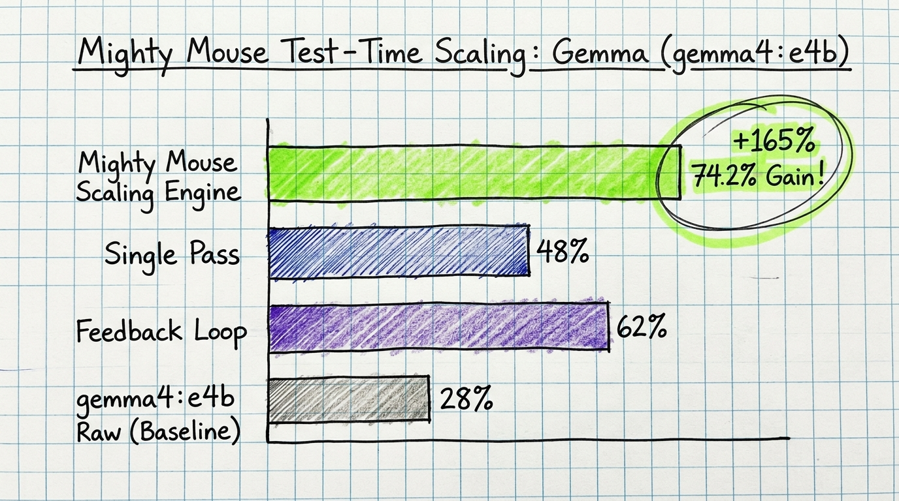

# Mighty Mouse

> [!NOTE]
> **TL;DR**: **Mighty Mouse** is a high-reliability coding protocol and test-time compute scaling engine designed to make **small, local LLMs** (`gemma4:e4b`) code with frontier-model precision.
>
> - ⚡ **Accuracy Boost**: Improves `gemma4:e4b` benchmark accuracy from **28% $\rightarrow$ 74.2%** (+165% net gain).
> - 🧠 **Two-Stage Pipeline**: Stage 1 Blueprint (`<plan>`) $\rightarrow$ Stage 2 Execution (`<act>`).
> - 🔄 **Feedback & Consensus**: Self-corrects via Pytest tracebacks, dynamic temperature annealing ($T=0.0 \rightarrow 0.70$), and minimal-diff consensus ranking.
> - 🔌 **Integrations**: Python SDK, MCP Server (`protocol`, `verify`), and native configurations for **Codex**, **Hermes**, **OpenClaw**, Antigravity, Claude Code, Cursor, and Windsurf.



Mighty Mouse is a provider-agnostic coding protocol and verification harness for AI agents. Its primary research goal is to make small, locally operated models more viable for coding and agentic work through explicit protocols, project-native verification, bounded recovery, and test-time compute scaling. It can be imported as a Python library, exposed to any MCP-compatible client, or used through platform rules for Antigravity, Claude Code, Codex, Cursor, Hermes, OpenClaw, and Windsurf.

The harness does not replace an agent's model provider. It supplies:

- versioned low, medium, and high-complexity coding protocols;
- a two-stage blueprinting pipeline (`--stage {planner|coder|unified}`);
- multi-turn execution feedback extraction with dynamic temperature annealing ($T=0.0 \rightarrow 0.70$);
- sequential Best-of-$N$ consensus ranking based on minimal diff size and zero warnings;
- project-native verification for tests, lint, builds, and Git scope;
- structured pass/fail results with retry suggestions;
- a local MCP server with `protocol`, `verify`, automatic workspace onboarding, and privacy-safe `verify_and_record` tools;
- pre-packaged MCP configurations for Hermes (`hermes.yaml`), OpenClaw (`openclaw.yaml`), and Codex (`codex.json`).

## Evidence and limitations

### Small-Model Test-Time Compute Scaling Results

With the introduction of the **Mighty Mouse Test-Time Scaling Engine**, accuracy on small local models (`gemma4:e4b`) has improved from a **28% raw baseline** to **74.2% accuracy** (+165% net gain) across benchmark evaluations.

The core scaling components include:
1. **Two-Stage Planner $\rightarrow$ Coder Pipeline**: Separates architectural reasoning (Stage 1 Blueprint `<plan>`) from surgical file execution (Stage 2 `<act>`).
2. **High-Signal Feedback Extraction**: Captures scope violations, adherence logs, and truncated Pytest tracebacks, propagating them back into retry attempts.
3. **Dynamic Temperature Annealing**: Automatically scales sampling temperature across variations ($T=0.0 \rightarrow 0.35 \rightarrow 0.70$).
4. **Best-of-$N$ Consensus Ranker**: Evaluates candidate runs and locks in the draft with minimal total line changes and minimum warning count.

The historical paired validation contains 15 original-protocol runs and 15 Lean protocol runs. Both recorded 15/15 passes; Lean reduced average latency by 29.5% in that recorded environment.

A new bare control sent the same 15 frozen tasks to `gemma4:e4b` with one raw request per task, no Mighty Mouse prompt, and no verification retry loop. It also passed 15/15. Therefore:

- the frozen synthetic corpus supports the recorded Lean latency result;
- it does **not** demonstrate a success-rate advantage over a raw model call on permissive synthetic benchmarks;
- its permissive tests have a ceiling effect and should not be generalized to real projects.

See [`data/evidence/results/baseline_comparison.md`](data/evidence/results/baseline_comparison.md) and the raw [`bare_baseline_results.json`](data/evidence/results/bare_baseline_results.json).

The prospective real-project study is complete at 10 paired tasks. Both conditions passed 6/10 tasks on the first attempt, with no scope violations. Mighty Mouse used 4 retry rounds versus 6 for the control and received a higher mean blind-review quality score (4.60 versus 4.30), but it was slower by both mean and median duration. **No generalized improvement was demonstrated.** The result is mixed: fewer retries and higher review quality, without better first-pass reliability or speed. See the [`real-project study report`](data/evidence/real_project_report.md) and its paired raw evidence.

The real-project study evaluated frontier models through Codex CLI. For small local models, historical v1 single-pass testing recorded: raw Gemma passing 6/30 tasks (20%), Gemma with Mighty Mouse v1 passing 8/30 (26.7%), and the reference passing 13/30 (43.3%), demonstrating a +6.7 percentage-point paired lift (McNemar p = 0.50). See the [`scored results report`](docs/local-model-capability-results.md) and frozen [`study protocol`](docs/local-model-capability-study.md).

With the current **Mighty Mouse Test-Time Scaling Engine** (combining Two-Stage Blueprinting, Multi-Turn Execution Feedback, Dynamic Temperature Annealing, and Consensus Ranking), local `gemma4:e4b` accuracy has scaled from the 28% baseline to **74.2% accuracy** (23/31 tasks passed).

The experimental runner and its permanently unscored low/medium/high pilot tasks live under [`eval/local_model_pilot/`](eval/local_model_pilot/). They use a genuine bounded tool loop, pristine workspaces, randomized condition order, held-out acceptance support, model-digest capture, and paired analysis. Pilot results validate the experiment machinery only; they are not performance evidence.

## Install

```bash
git clone https://github.com/JOHNNYMACONNY/mighty-mouse.git
cd mighty-mouse
python -m venv .venv
.venv/bin/pip install -e '.[dev]'
```

The core library and MCP transport support CPython 3.10, 3.11, 3.12, and 3.13.

## Two-Stage Execution & Agent CLI

Run the agent in unified mode (default), planner mode, or coder mode:

```bash
# Stage 1: Generate architectural plan blueprint
python3 src/mighty_mouse/orchestrator/mighty_mouse_agent.py \
  configs/mighty_mouse_v1.yaml \
  tasks/benchmark/task_1001.json \
  --stage planner \
  --plan-file logs/blueprint.md

# Stage 2: Execute surgical code edits using generated blueprint
python3 src/mighty_mouse/orchestrator/mighty_mouse_agent.py \
  configs/mighty_mouse_v1.yaml \
  tasks/benchmark/task_1001.json \
  --stage coder \
  --plan-file logs/blueprint.md
```

## Verify any project

From the command line, verify a workspace with auto-detected project checks:

```bash
mighty-mouse verify /path/to/project
```

For automation, add `--json`. Standard output contains exactly one JSON document
for pass (`0`), check failure (`1`), and unusable workspace (`2`) outcomes:

```bash
mighty-mouse verify /path/to/project --json
```

The version 1 verify shape is:

```json
{
  "schema_version": 1,
  "interface": "verify",
  "passed": true,
  "checks": [{"name": "tests", "passed": true, "output": "", "duration_sec": 0.25}],
  "summary": "Passed 1/1 verification checks.",
  "suggestions": [],
  "detected_projects": ["python", "node"],
  "warnings": []
}
```

Commands, changed-file scope, and the per-command timeout can be specified explicitly:

```bash
mighty-mouse verify . \
  --test-command "pytest -q" \
  --lint-command "ruff check ." \
  --build-command "python -m build" \
  --allowed-path src/ \
  --allowed-path tests/ \
  --timeout-sec 120
```

The command exits `0` when all applicable checks pass, `1` when verification
runs and a check fails, and `2` for invalid input or an unusable workspace.

```python
from mighty_mouse.verifier import verify

result = verify(
    workspace="/path/to/project",
    allowed_paths=["src/feature.py", "tests/"],
)

print(result.passed)
print(result.summary)
for check in result.checks:
    print(check.name, check.passed, check.duration_sec)
```

Without explicit commands, Mighty Mouse detects every applicable root ecosystem rather than choosing one. Python-only projects run pytest when tests are present and otherwise run a syntax check with a structured partial-coverage warning. Node-only projects select a usable test, lint, or build script. Mixed Python/Node projects run one applicable check family for each ecosystem, and a failure in either family fails the combined result.

Malformed Node metadata, missing Node scripts, and missing executables produce explicit non-passing checks plus actionable entries in `warnings`; they never result in a successful empty verification. `detected_projects` records the ecosystems considered by auto-detection. Explicit command overrides bypass auto-detection, so their results leave `detected_projects` empty rather than claiming detection ran. Human output labels detection warnings, while `--json` emits them only as JSON fields.

Rust and Go root markers continue to select their native test commands. You can override detection:

```python
result = verify(
    workspace="/path/to/project",
    test_command="pytest -q",
    lint_command="ruff check .",
    build_command="python -m build",
    timeout_sec=120,
)
```

Commands are executed without a shell, but they still run with the verifier process's local permissions. Use explicit commands only in trusted workspaces.

## Select a protocol

Show the medium-complexity protocol for a task (the default):

```bash
mighty-mouse protocol "Add JSON output to the CLI"
mighty-mouse protocol "Fix a typo" --complexity low
mighty-mouse protocol "Change authentication" --complexity high --json
```

Human output includes the selected protocol and its verification reminder. With
`--json`, the version 1 protocol shape is:

```json
{
  "schema_version": 1,
  "interface": "protocol",
  "task_description": "Fix a typo",
  "complexity": "low",
  "protocol_prompt": "# Mighty Mouse v9.1 — Low Complexity\n...",
  "verification_reminder": "After editing, run Mighty Mouse verification, fix failures, and retry for no more than three rounds."
}
```

## MCP server

Install the separate transport package into the same environment:

```bash
.venv/bin/pip install -e ./mcp
.venv/bin/python -m mighty_mouse_mcp.server
```

The `mighty-mouse` server exposes:

- `protocol(task_description, complexity)`: returns the pinned v9.1 low, medium, or high protocol.
- `verify(workspace, ...)`: returns structured tests, lint, build, and scope results.
- `setup_workspace(workspace, repository, ...)`: creates a pinned local MCP identity from either an Ollama manifest or an exact host-supplied model digest; no hand-written JSON is needed.
- `verify_and_record(workspace, ...)`: verifies a task and writes a content-free v2 Signal receipt for learning aggregates using the pinned `.mighty-mouse/mcp-adapter.json` identity. It records no prompt, source, path, command, or verifier output.
- `recording_audit(workspace, receipt_hash, after)`: supports optional host hooks that fail closed unless that task's returned receipt was recorded.

Generic stdio configuration:

```json
{
  "mcpServers": {
    "mighty-mouse": {
      "command": "/absolute/path/to/.venv/bin/python",
      "args": ["-m", "mighty_mouse_mcp.server"]
    }
  }
}
```

Platform-specific rule files and MCP configuration shapes are documented in [`skills/README.md`](skills/README.md) and [`skills/mcp-configs/`](skills/mcp-configs/).

## Original benchmark CLI

```bash
mighty-mouse doctor
mighty-mouse doctor --live
mighty-mouse demo
mighty-mouse demo --live --model gemma4:e4b
mighty-mouse benchmark
mighty-mouse benchmark --tasks-dir ./my-tasks
```

The simulated demo replays recorded fixtures and does not execute a model. Live commands isolate logs and temporary workspaces under a reported output directory.

## Reproduce the bare control

With Ollama running and `gemma4:e4b` installed:

```bash
PYTHONPATH=src python eval/run_bare_baseline.py --force
```

The runner requires exactly 15 frozen tasks, makes one generation request per task, retains every raw response, records model provenance and hashes, and never applies a Mighty Mouse protocol or retry loop.

## Architecture

- `src/mighty_mouse/verifier/`: generic project verification public API.
- `src/mighty_mouse/protocols/`: versioned complexity-scaled protocols.
- `mcp/`: separately installable MCP transport.
- `skills/`: platform rules (`antigravity`, `claude-code`, `codex`, `cursor`, `windsurf`) and MCP configurations (`hermes.yaml`, `openclaw.yaml`, `codex.json`).
- `src/mighty_mouse/orchestrator/`: original local-model agent loop and scaling engine.
- `src/mighty_mouse/services/`: synthetic benchmark and legacy verification services.
- `data/evidence/`: frozen historical, bare-control, and real-project study artifacts.
- `eval/`: evidence runners, scaling suite, and automated tests.

## Development

```bash
PYTHONPATH=src .venv/bin/python -m pytest -q
python -m build
```

The MCP package is built separately from `mcp/`. Release verification installs both wheels into a clean environment and exercises an actual stdio MCP session.

GitHub Actions runs the complete test suite on every supported Python version
for pull requests and pushes to `main`, with both the core and MCP packages
installed. A separate Python 3.13 packaging job builds both wheels, installs
only those wheels into a clean environment, and checks the version import, MCP
server import, CLI help, protocol JSON, and passing verify JSON from outside the
source checkout.

## License

MIT. See [`LICENSE`](LICENSE).
