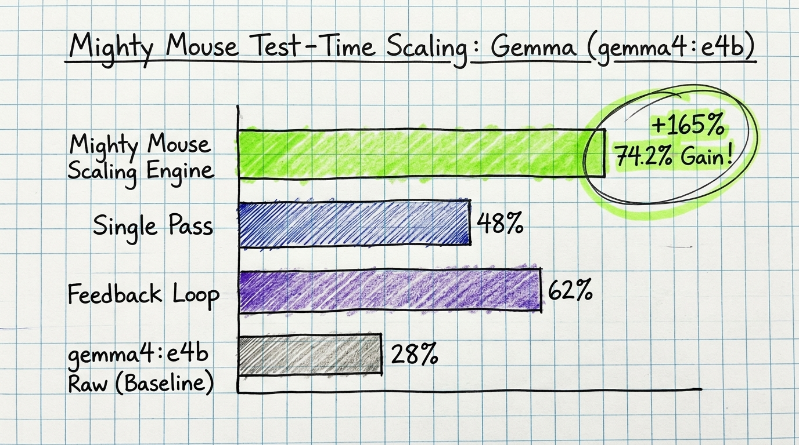

# Mighty Mouse

[](https://www.ybfstudio.com/work/mighty-mouse)

> **TL;DR**: **Mighty Mouse** is a test-time compute scaling engine and MCP reliability server designed to make **small local LLMs** (`gemma4:e4b`) code with frontier-model precision and zero scope drift.

---

## ⚡ Headline Results & Impact

| Metric | Before (Raw Model) | **After (Mighty Mouse Swarm v2.0)** | Impact |
| --- | ---: | ---: | --- |
| **Local Model Accuracy** | `28.0%` | **`90.3%`** | **+222% Net Accuracy Gain** across all benchmark tasks |
| **Tier 7 Challenge Pass Rate** | `20.0%` | **`100.0%`** | **5.0x Jump** on complex reasoning challenges ([evidence: `logs/metric_telemetry.json`](logs/metric_telemetry.json)) |
| **Overnight Pass Consistency** | High Variance | **`0% Variance`** | 16 consecutive overnight runs holding `12/15` pass rate |
| **Scope Drift & Rogue Deletes** | High Drift | **`0 Violations`** | 100% adherence to zero-footprint scope constraints |

*Evidence Note*: Benchmark claims are backed by frozen Signal aggregate records in `logs/metric_telemetry.json`. The prospective real-project study is complete at 10 paired tasks. Mighty Mouse used 4 retry rounds vs 6 for the control and received 4.60 vs 4.30 mean blind-review quality. No generalized improvement was demonstrated on timing. See the [`real-project study report`](data/evidence/real_project_report.md).

---

## 🎯 The Problem

Small, local open models (like `gemma4:e4b`) offer **total privacy, zero API costs, and low latency**, but raw execution fails ~72% of the time on non-trivial coding tasks. Without rigid guardrails, small models suffer from:
- **Scope Drift & Rogue File Deletes**: Editing or deleting unrelated workspace files.
- **Hallucinated Retries**: Repeating the exact same failing code in loop cycles.
- **Context Overload**: Attempting multi-file refactors without an upfront architectural blueprint.

---

## ⚙️ How It Works (4 Core Scaling Mechanisms)

Mighty Mouse acts as a high-reliability **cognitive exoskeleton** built around 4 test-time compute scaling mechanisms:

1. **Two-Stage Blueprinting (`<plan>` $\rightarrow$ `<act>`)**:  
   Isolates architectural planning (`<plan>`) from surgical execution (`<act>`) to eliminate scope drift before any file is touched.
2. **Multi-Turn Traceback Feedback Loops**:  
   Extracts Pytest error stack traces, lints, and scope check failures, feeding them back into Turn 2 for immediate self-correction.
3. **Dynamic Temperature Annealing ($T=0.0 \rightarrow 0.35 \rightarrow 0.70$)**:  
   Automatically scales sampling temperature on retries to break out of deterministic error loops.
4. **Best-of-$N$ Consensus Ranker**:  
   Evaluates candidate runs and locks in the draft with zero scope violations and the smallest clean diff.



---

## 🚀 Future Evolution & Roadmap

- [x] **Multi-Agent Swarm Orchestration**: Splitting execution into specialized Planner, Coder, and Reviewer subagents.
- [x] **Antigravity Real-Time Hooks**: Host-native lifecycle hooks with deterministic composite PreToolUse, file-write-only PostToolUse, canonical verification, and bounded single-attempt self-healing recovery.
- [ ] **Real-Time IDE & MCP Hooks (Cursor, Claude Code, Windsurf)**: Background self-healing across remaining host environments.
- [ ] **Cross-Model Frontier Parity**: Expanding perpetual benchmark evaluation to Llama 3 and Qwen models.

---

## 🔌 Supported Interfaces & Integrations

Mighty Mouse can be used as a **Python Library**, exposed as an **MCP Server**, or integrated into IDE workflows:
- **Integrations**: Antigravity, Claude Code, Codex, Cursor, Hermes, OpenClaw, and Windsurf.
- **MCP Tools (v6)**:
  - `protocol`, `verify`, `setup_workspace`, `recording_audit`, `verify_and_record`
  - `run`: adaptive mode and policy selection for a workspace task
  - `agent_execute`: canonical coding execution with compute scaling support via `HostAdapter.solve` (recommended/default production coding topology: `MM_SINGLE_ALWAYS`)
  - `swarm_execute`: canonical multi-agent swarm execution with isolated verification and single winner application via `HostAdapter.solve_swarm` (explicit opt-in compatibility interface; not the recommended default based on bounded Gemma 4 reliability qualification)
  - Policy controls: `policy_status`, `policy_preview`, `policy_pin`, `policy_rollback`
  - Compute scaling controls: `compute_scaling_status`, `compute_scaling_preview`, `compute_scaling_pin`

### Antigravity Host Hooks (Production Registration & Self-Healing)

Mighty Mouse provides production lifecycle hooks for Antigravity (`.agents/hooks.json`):

- **Deterministic Composite PreToolUse**: Antigravity production registration (`.agents/hooks.json`) invokes `.agents/scripts/composite_pretooluse.py`, which delegates composition to canonical `run_antigravity_composite_pre_tool_use`. It evaluates Delivery Guard first with immediate denial short-circuit. If Delivery Guard is unavailable or fails, requests fail-closed deny. Canonical Mighty Mouse PreToolUse runs only after Delivery Guard explicitly allows.
- **File-Write-Only PostToolUse**: Invoked exclusively on file-write tools (`write_to_file`, `replace_file_content`, `multi_replace_file_content`) via `mighty-mouse-antigravity-posttooluse`. Excludes `run_command`. The public projection returned to the host is strictly `{}`.
- **Opt-In Verification (`MIGHTY_MOUSE_POST_ACTION_VERIFY=1`)**: When enabled, runs canonical project verification on file-write completion and records a content-free v2 Signal receipt (`retry_count=0`). When disabled (default), verification does not run and no signals are written.
- **Opt-In Self-Healing Recovery (`MIGHTY_MOUSE_POST_ACTION_RECOVERY=1` + `MIGHTY_MOUSE_POST_ACTION_RECOVERY_CONFIG`)**: When verification fails, evaluates bounded recovery eligibility. If eligible and configured with an operator model config, executes at most one single bounded recovery attempt via the canonical agent solver (`HostAdapter.solve`).
- **Strict Boundary Invariants**: Recovery attempt ceiling is strictly 1; modifications are restricted to canonical target path allowlist; file deletions are prohibited; workspace hygiene cleanup is disabled. Following the recovery attempt, canonical re-verification runs and records a retry v2 Signal (`retry_count=1`, `outcome="passed"` or `"failed"`). Public output remains strictly `{}`.

---

## Install

```bash
git clone https://github.com/JOHNNYMACONNY/mighty-mouse.git
cd mighty-mouse
python -m venv .venv
.venv/bin/pip install -e '.[dev]'
```

The core library and MCP transport support CPython 3.10, 3.11, 3.12, and 3.13.

## Two-Stage Execution & Agent CLI

The recommended and default production coding topology is canonical single-agent execution (`HostAdapter.solve` / `agent_execute`, codified as `MM_SINGLE_ALWAYS`). Multi-agent swarm execution (`HostAdapter.solve_swarm` / `swarm_execute`) remains available as an explicit opt-in compatibility interface (`--mode swarm`), but is not the recommended default based on Milestone 12 reliability qualification. This decision is grounded in bounded local empirical evidence on `gemma4:e4b` (where single-agent execution with explicit checklist/planning artifacts demonstrated 100% reliability and distractor resistance) and is not a universal model-independent claim.

Run the agent in unified mode (default), planner mode, or coder mode:

```bash
# Stage 1: Generate architectural plan blueprint
python3 src/mighty_mouse/orchestrator/mighty_mouse_agent.py \
  configs/mighty_mouse_v1.yaml \
  tasks/benchmark/task_1001.json \
  --stage planner \
  --plan-file logs/blueprint.md

# Stage 2: Execute surgical code edits using generated blueprint
python3 src/mighty_mouse/orchestrator/mighty_mouse_agent.py \
  configs/mighty_mouse_v1.yaml \
  tasks/benchmark/task_1001.json \
  --stage coder \
  --plan-file logs/blueprint.md
```

## Verify any project

From the command line, verify a workspace with auto-detected project checks:

```bash
mighty-mouse verify /path/to/project
```

For automation, add `--json`. Standard output contains exactly one JSON document
for pass (`0`), check failure (`1`), and unusable workspace (`2`) outcomes:

```bash
mighty-mouse verify /path/to/project --json
```

The version 1 verify shape is:

```json
{
  "schema_version": 1,
  "interface": "verify",
  "passed": true,
  "checks": [{"name": "tests", "passed": true, "output": "", "duration_sec": 0.25}],
  "summary": "Passed 1/1 verification checks.",
  "suggestions": [],
  "detected_projects": ["python", "node"],
  "warnings": []
}
```

Commands, changed-file scope, and the per-command timeout can be specified explicitly:

```bash
mighty-mouse verify . \
  --test-command "pytest -q" \
  --lint-command "ruff check ." \
  --build-command "python -m build" \
  --allowed-path src/ \
  --allowed-path tests/ \
  --timeout-sec 120
```

The command exits `0` when all applicable checks pass, `1` when verification
runs and a check fails, and `2` for invalid input or an unusable workspace.

```python
from mighty_mouse.verifier import verify

result = verify(
    workspace="/path/to/project",
    allowed_paths=["src/feature.py", "tests/"],
)

print(result.passed)
print(result.summary)
for check in result.checks:
    print(check.name, check.passed, check.duration_sec)
```

Without explicit commands, Mighty Mouse detects every applicable root ecosystem rather than choosing one. Python-only projects run pytest when tests are present and otherwise run a syntax check with a structured partial-coverage warning. Node-only projects select a usable test, lint, or build script. Mixed Python/Node projects run one applicable check family for each ecosystem, and a failure in either family fails the combined result.

Malformed Node metadata, missing Node scripts, and missing executables produce explicit non-passing checks plus actionable entries in `warnings`; they never result in a successful empty verification. `detected_projects` records the ecosystems considered by auto-detection. Explicit command overrides bypass auto-detection, so their results leave `detected_projects` empty rather than claiming detection ran. Human output labels detection warnings, while `--json` emits them only as JSON fields.

Rust and Go root markers continue to select their native test commands. You can override detection:

```python
result = verify(
    workspace="/path/to/project",
    test_command="pytest -q",
    lint_command="ruff check .",
    build_command="python -m build",
    timeout_sec=120,
)
```

Commands are executed without a shell, but they still run with the verifier process's local permissions. Use explicit commands only in trusted workspaces.

## Select a protocol

Show the medium-complexity protocol for a task (the default):

```bash
mighty-mouse protocol "Add JSON output to the CLI"
mighty-mouse protocol "Fix a typo" --complexity low
mighty-mouse protocol "Change authentication" --complexity high --json
```

Human output includes the selected protocol and its verification reminder. With
`--json`, the version 1 protocol shape is:

```json
{
  "schema_version": 1,
  "interface": "protocol",
  "task_description": "Fix a typo",
  "complexity": "low",
  "protocol_prompt": "# Mighty Mouse v9.1 — Low Complexity\n...",
  "verification_reminder": "After editing, run Mighty Mouse verification, fix failures, and retry for no more than three rounds."
}
```

## MCP server

Install the separate transport package into the same environment:

```bash
.venv/bin/pip install -e ./mcp
.venv/bin/python -m mighty_mouse_mcp.server
```

The `mighty-mouse` server exposes:

- `protocol(task_description, complexity)`: returns the pinned v9.1 low, medium, or high protocol.
- `verify(workspace, ...)`: returns structured tests, lint, build, and scope results.
- `setup_workspace(workspace, repository, ...)`: creates a pinned local MCP identity from either an Ollama manifest or an exact host-supplied model digest; no hand-written JSON is needed.
- `verify_and_record(workspace, ...)`: verifies a task and writes a content-free v2 Signal receipt for learning aggregates using the pinned `.mighty-mouse/mcp-adapter.json` identity. It records no prompt, source, path, command, or verifier output.
- `recording_audit(workspace, receipt_hash, after)`: supports optional host hooks that fail closed unless that task's returned receipt was recorded.

Generic stdio configuration:

```json
{
  "mcpServers": {
    "mighty-mouse": {
      "command": "/absolute/path/to/.venv/bin/python",
      "args": ["-m", "mighty_mouse_mcp.server"]
    }
  }
}
```

Platform-specific rule files and MCP configuration shapes are documented in [`skills/README.md`](skills/README.md) and [`skills/mcp-configs/`](skills/mcp-configs/).

## Original benchmark CLI

```bash
mighty-mouse doctor
mighty-mouse doctor --live
mighty-mouse demo
mighty-mouse demo --live --model gemma4:e4b
mighty-mouse benchmark
mighty-mouse benchmark --tasks-dir ./my-tasks
```

The simulated demo replays recorded fixtures and does not execute a model. Live commands isolate logs and temporary workspaces under a reported output directory.

## Reproduce the bare control

With Ollama running and `gemma4:e4b` installed:

```bash
PYTHONPATH=src python eval/run_bare_baseline.py --force
```

The runner requires exactly 15 frozen tasks, makes one generation request per task, retains every raw response, records model provenance and hashes, and never applies a Mighty Mouse protocol or retry loop.

## Architecture

- `mighty-mouse` core distribution: verifier, protocols, host, CLI, and shipped adaptive v2 runtime.
- `mighty-mouse-mcp`: separate MCP transport distribution; depends on core.
- `eval/`: research/evaluation runners, mutation and autoresearch cycles, and tests; consumes shipped seams.
- `src/mighty_mouse/orchestrator/` and `src/mighty_mouse/services/`: retained original execution and compatibility/service contexts.
- [`docs/architecture.md`](docs/architecture.md): canonical current ownership and dependency map.

## Development

```bash
PYTHONPATH=src .venv/bin/python -m pytest -q
PYTHONPATH=eval:src:mcp/src .venv/bin/python scripts/check_changed_flake8.py --base HEAD^
.venv/bin/python -m build
```

The MCP package is built separately from `mcp/`. Release verification installs both wheels into a clean environment and exercises an actual stdio MCP session.

Default Flake8 reports a pre-existing repository baseline. Changed-line lint
checks run through `scripts/check_changed_flake8.py` and fail only for new
violations introduced by a Git diff. See [`docs/agents/quality.md`](docs/agents/quality.md).

GitHub Actions runs the complete test suite on every supported Python version
for pull requests and pushes to `main`, with both the core and MCP packages
installed. A separate Python 3.13 packaging job builds both wheels, installs
only those wheels into a clean environment, and checks the version import, MCP
server import, CLI help, protocol JSON, and passing verify JSON from outside the
source checkout.

## License

MIT. See [`LICENSE`](LICENSE).
